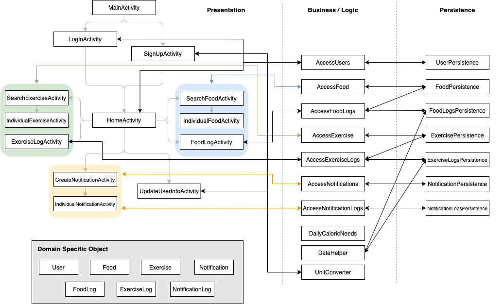
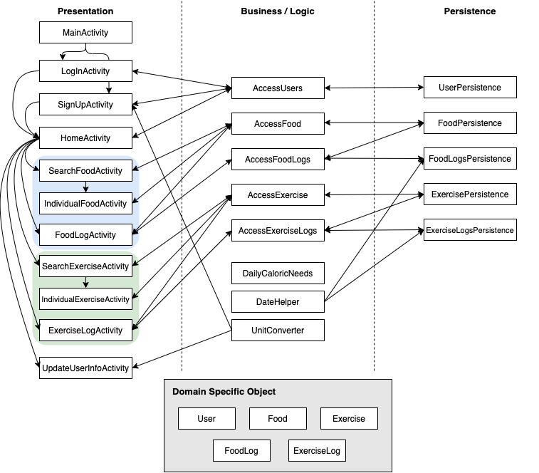

Architecture
============

Iteration 3 Diagram
-------------------

Iteration 2 Diagram
-------------------

Iteration 1 Diagram
-------------------

Presentation Layer
------------------
[MainActivity](https://code.cs.umanitoba.ca/3350-winter-2021-a01/fitnics-group-12/-/blob/master/app/src/main/java/com/group12/fitnics/presentation/MainActivity.java)
 - An entrance page that allows users to sign up or log in to go to the home screen

[LogInActivity](https://code.cs.umanitoba.ca/3350-winter-2021-a01/fitnics-group-12/-/blob/master/app/src/main/java/com/group12/fitnics/presentation/LogInActivity.java)
 - A screen that allows you to log in by entering a user name

[SignUpActivity](https://code.cs.umanitoba.ca/3350-winter-2021-a01/fitnics-group-12/-/blob/master/app/src/main/java/com/group12/fitnics/presentation/SignUpActivity.java)
 - A screen that asks for necessary information to register a user

[HomeActivity](https://code.cs.umanitoba.ca/3350-winter-2021-a01/fitnics-group-12/-/blob/master/app/src/main/java/com/group12/fitnics/presentation/HomeActivity.java)
 - A home screen where user can check calorie intake and calorie consumption during the day

[SearchFoodActivity](https://code.cs.umanitoba.ca/3350-winter-2021-a01/fitnics-group-12/-/blob/master/app/src/main/java/com/group12/fitnics/presentation/SearchFoodActivity.java)
 - A screen where to search for food to get information
 
[IndividualFoodActivity](https://code.cs.umanitoba.ca/3350-winter-2021-a01/fitnics-group-12/-/blob/master/app/src/main/java/com/group12/fitnics/presentation/IndividualFoodActivity.java)
 - A screen where user can add a food item to their list of foods eaten

[FoodLogActivity](https://code.cs.umanitoba.ca/3350-winter-2021-a01/fitnics-group-12/-/blob/master/app/src/main/java/com/group12/fitnics/presentation/FoodLogActivity.java)
 - A place where the types and amounts of foods eaten during the day are listed

[SearchExerciseActivity](https://code.cs.umanitoba.ca/3350-winter-2021-a01/fitnics-group-12/-/blob/master/app/src/main/java/com/group12/fitnics/presentation/SearchExerciseActivity.java)
 - A screen where to search for exercise to get information
 
[IndividualExercise](https://code.cs.umanitoba.ca/3350-winter-2021-a01/fitnics-group-12/-/blob/master/app/src/main/java/com/group12/fitnics/presentation/IndividualExercise.java)
 - A screen where user can add an exercise item to their list of exercises done

[ExerciseLogActivity](https://code.cs.umanitoba.ca/3350-winter-2021-a01/fitnics-group-12/-/blob/master/app/src/main/java/com/group12/fitnics/presentation/ExerciseLogActivity.java)
 - A place where the types and amounts of exercises done during the day are listed
 
[UpdateUserInfoActivity](https://code.cs.umanitoba.ca/3350-winter-2021-a01/fitnics-group-12/-/blob/master/app/src/main/java/com/group12/fitnics/presentation/UpdateUserInfoActivity.java)
 - A screen where user can update their information
 
[CreateNotificationActivity](https://code.cs.umanitoba.ca/3350-winter-2021-a01/fitnics-group-12/-/blob/master/app/src/main/java/com/group12/fitnics/presentation/CreateNotificationActivity.java)
 - A screen where user can view a list of notification set, and add a new one
  
[IndividualNotificationActivity](https://code.cs.umanitoba.ca/3350-winter-2021-a01/fitnics-group-12/-/blob/master/app/src/main/java/com/group12/fitnics/presentation/IndividualNotificationActivity.java)
 - A screen where user can make a change or delete one notification
 

Application Layer
-----------------
[Main](https://code.cs.umanitoba.ca/3350-winter-2021-a01/fitnics-group-12/-/blob/master/app/src/main/java/com/group12/fitnics/application/Main.java)
 - The class that sets up database

[Services](https://code.cs.umanitoba.ca/3350-winter-2021-a01/fitnics-group-12/-/blob/master/app/src/main/java/com/group12/fitnics/application/Services.java)
 - The class that provides persistence objects

Logic Layer
--------------
[AccessUsers](https://code.cs.umanitoba.ca/3350-winter-2021-a01/fitnics-group-12/-/blob/master/app/src/main/java/com/group12/fitnics/business/AccessUsers.java)
 - The class the representation layer calls to do users-related things

[AccessFood](https://code.cs.umanitoba.ca/3350-winter-2021-a01/fitnics-group-12/-/blob/master/app/src/main/java/com/group12/fitnics/business/AccessFood.java)
 - The class the representation layer calls to do foods-related things

[AccessFoodLogs](https://code.cs.umanitoba.ca/3350-winter-2021-a01/fitnics-group-12/-/blob/master/app/src/main/java/com/group12/fitnics/business/AccessFoodLogs.java)
 - The class the representation layer calls to do food logs-related things
 
[AccessExercises](https://code.cs.umanitoba.ca/3350-winter-2021-a01/fitnics-group-12/-/blob/master/app/src/main/java/com/group12/fitnics/business/AccessExercises.java)
 - The class the representation layer calls to do exercises-related things

[AccessExerciseLogs](https://code.cs.umanitoba.ca/3350-winter-2021-a01/fitnics-group-12/-/blob/master/app/src/main/java/com/group12/fitnics/business/AccessExerciseLogs.java)
 - The class the representation layer calls to do exercise logs-related things
 
[AccessNotification](https://code.cs.umanitoba.ca/3350-winter-2021-a01/fitnics-group-12/-/blob/master/app/src/main/java/com/group12/fitnics/business/AccessNotification.java)
 - The class the representation layer calls to do notification-related things

[AccessNotificationLogs](https://code.cs.umanitoba.ca/3350-winter-2021-a01/fitnics-group-12/-/blob/master/app/src/main/java/com/group12/fitnics/business/AccessNotificationLogs.java)
 - The class the representation layer calls to do notification logs-related things

[DailyCaloricNeeds](https://code.cs.umanitoba.ca/3350-winter-2021-a01/fitnics-group-12/-/blob/master/app/src/main/java/com/group12/fitnics/business/DailyCaloricNeeds.java)
 - The helper class to calculate daily calorie needs based on a user information
 
[DateHelper](https://code.cs.umanitoba.ca/3350-winter-2021-a01/fitnics-group-12/-/blob/master/app/src/main/java/com/group12/fitnics/business/DateHelper.java)
 - The helper class that converts LocalDate objects into strings or strings representing dates into LocalDate objects.

[UnitConverter](https://code.cs.umanitoba.ca/3350-winter-2021-a01/fitnics-group-12/-/blob/master/app/src/main/java/com/group12/fitnics/business/UnitConverter.java)
 - The helper class responsible for unit conversion of weight(lbs, kg) and height(cm, ft). 
 

### Exceptions

#### User-related 
[InvalidUserException](https://code.cs.umanitoba.ca/3350-winter-2021-a01/fitnics-group-12/-/blob/master/app/src/main/java/com/group12/fitnics/exceptions/InvalidUserException.java)
 - The exception class for invalid User object (null)
 
[InvalidUserInfoException](https://code.cs.umanitoba.ca/3350-winter-2021-a01/fitnics-group-12/-/blob/master/app/src/main/java/com/group12/fitnics/exceptions/InvalidUserInfoException.java)
 - The exception class for invalid user information
 
[InvalidUserNameException](https://code.cs.umanitoba.ca/3350-winter-2021-a01/fitnics-group-12/-/blob/master/app/src/main/java/com/group12/fitnics/exceptions/InvalidUserNameException.java)
 - The exception class for checking that the user name is empty or too long
 
[InvalidSignUpDateException](https://code.cs.umanitoba.ca/3350-winter-2021-a01/fitnics-group-12/-/blob/master/app/src/main/java/com/group12/fitnics/exceptions/InvalidSignUpDateException.java)
 - The exception class for invalid date
 
[UserNotFoundException](https://code.cs.umanitoba.ca/3350-winter-2021-a01/fitnics-group-12/-/blob/master/app/src/main/java/com/group12/fitnics/exceptions/UserNotFoundException.java)
 - The exception class for when a User object requested was not found

#### Food-related 
[InvalidFoodException](https://code.cs.umanitoba.ca/3350-winter-2021-a01/fitnics-group-12/-/blob/master/app/src/main/java/com/group12/fitnics/exceptions/InvalidFoodException.java)
 - The exception class for invalid Food object (null)
 
[InvalidFdNameException](https://code.cs.umanitoba.ca/3350-winter-2021-a01/fitnics-group-12/-/blob/master/app/src/main/java/com/group12/fitnics/exceptions/InvalidFdNameException.java)
 - The exception class for checking that the food name is too long
 
[FoodNotFoundException](https://code.cs.umanitoba.ca/3350-winter-2021-a01/fitnics-group-12/-/blob/master/app/src/main/java/com/group12/fitnics/exceptions/FoodNotFoundException.java)
 - The exception class for when a Food object requested was not found

#### Exercise-related 
[InvalidExerciseException](https://code.cs.umanitoba.ca/3350-winter-2021-a01/fitnics-group-12/-/blob/master/app/src/main/java/com/group12/fitnics/exceptions/InvalidExerciseException.java)
 - The exception class for invalid Food object (null)
 
[InvalidExNameException](https://code.cs.umanitoba.ca/3350-winter-2021-a01/fitnics-group-12/-/blob/master/app/src/main/java/com/group12/fitnics/exceptions/InvalidExNameException.java)
 - The exception class for checking that the title of the exercise is too long
 
[InvalidExDescException](https://code.cs.umanitoba.ca/3350-winter-2021-a01/fitnics-group-12/-/blob/master/app/src/main/java/com/group12/fitnics/exceptions/InvalidExDescException.java)
 - The exception class for checking that the description of the exercise is too long
 
[InvalidExCategoryException](https://code.cs.umanitoba.ca/3350-winter-2021-a01/fitnics-group-12/-/blob/master/app/src/main/java/com/group12/fitnics/exceptions/InvalidExCategoryException.java)
 - The exception class for checking that the category name of the exercise is too long
 
[InvalidExLevelException](https://code.cs.umanitoba.ca/3350-winter-2021-a01/fitnics-group-12/-/blob/master/app/src/main/java/com/group12/fitnics/exceptions/InvalidExLevelException.java)
 - The exception class for checking that the level of the exercise is too long
 
[ExerciseNotFoundException](https://code.cs.umanitoba.ca/3350-winter-2021-a01/fitnics-group-12/-/blob/master/app/src/main/java/com/group12/fitnics/exceptions/ExerciseNotFoundException.java)
 - The exception class for when an Exercise object requested was not found

#### FoodLog-related 
[InvalidFoodLogException](https://code.cs.umanitoba.ca/3350-winter-2021-a01/fitnics-group-12/-/blob/master/app/src/main/java/com/group12/fitnics/exceptions/InvalidFoodLogException.java)
 - The exception class for invalid FoodLog object (null)
 
[FoodLogNotFoundException](https://code.cs.umanitoba.ca/3350-winter-2021-a01/fitnics-group-12/-/blob/master/app/src/main/java/com/group12/fitnics/exceptions/FoodLogNotFoundException.java)
 - The exception class for when an FoodLog object requested was not found

#### ExerciseLog-related 
[InvalidExerciseLogException](https://code.cs.umanitoba.ca/3350-winter-2021-a01/fitnics-group-12/-/blob/master/app/src/main/java/com/group12/fitnics/exceptions/InvalidExerciseLogException.java)
 - The exception class for invalid ExerciseLog object (null)
 
[ExerciseLogNotFoundException](https://code.cs.umanitoba.ca/3350-winter-2021-a01/fitnics-group-12/-/blob/master/app/src/main/java/com/group12/fitnics/exceptions/ExerciseLogNotFoundException.java)
 - The exception class for when an ExerciseLog object requested was not found

#### Notification and NotificationLog-related
[InvalidNotificationException](https://code.cs.umanitoba.ca/3350-winter-2021-a01/fitnics-group-12/-/blob/master/app/src/main/java/com/group12/fitnics/exceptions/InvalidNotificationException.java)
 - The exception class for invalid Notification object (null)
 
[InvalidNotificationLogException](https://code.cs.umanitoba.ca/3350-winter-2021-a01/fitnics-group-12/-/blob/master/app/src/main/java/com/group12/fitnics/exceptions/InvalidNotificationLogException.java)
 - The exception class for invalid NotificationLog object (null)
 
[InvalidNotifLogTitleException](https://code.cs.umanitoba.ca/3350-winter-2021-a01/fitnics-group-12/-/blob/master/app/src/main/java/com/group12/fitnics/exceptions/InvalidNotifLogTitleException.java)
 - The exception class for checking if the title of notification is too long
 
#### Other
[InvalidUnitsException](https://code.cs.umanitoba.ca/3350-winter-2021-a01/fitnics-group-12/-/blob/master/app/src/main/java/com/group12/fitnics/exceptions/InvalidUnitsException.java)
 - The exception class for when the weight or height is out of the allowable number range
 
 
Persistence Layer
-----------------
[IUserPersistence](https://code.cs.umanitoba.ca/3350-winter-2021-a01/fitnics-group-12/-/blob/master/app/src/main/java/com/group12/fitnics/persistence/IUserPersistence.java)
 - The interface for handling the user in the database

[IFoodPersistence](https://code.cs.umanitoba.ca/3350-winter-2021-a01/fitnics-group-12/-/blob/master/app/src/main/java/com/group12/fitnics/persistence/IFoodPersistence.java)
 - The interface for handling the set of foods in the database
 
[IFoodLogPersistence](https://code.cs.umanitoba.ca/3350-winter-2021-a01/fitnics-group-12/-/blob/master/app/src/main/java/com/group12/fitnics/persistence/IFoodLogPersistence.java)
 - The interface for handling the food logs in the database
 
[IExercisePersistence](https://code.cs.umanitoba.ca/3350-winter-2021-a01/fitnics-group-12/-/blob/master/app/src/main/java/com/group12/fitnics/persistence/IExercisePersistence.java)
 - The interface for handling the set of exercises in the database

[IExerciseLogPersistence](https://code.cs.umanitoba.ca/3350-winter-2021-a01/fitnics-group-12/-/blob/master/app/src/main/java/com/group12/fitnics/persistence/IExerciseLogPersistence.java)
 - The interface for the exercise logs in the database

[INotificationPersistence](https://code.cs.umanitoba.ca/3350-winter-2021-a01/fitnics-group-12/-/blob/master/app/src/main/java/com/group12/fitnics/persistence/INotificationPersistence.java)
 - The interface for handling the set of notifications in the database

[INotificationLogPersistence](https://code.cs.umanitoba.ca/3350-winter-2021-a01/fitnics-group-12/-/blob/master/app/src/main/java/com/group12/fitnics/persistence/INotificationLogPersistence.java)
 - The interface for the notification logs in the database

### Stubs
[UserPersistenceStub](https://code.cs.umanitoba.ca/3350-winter-2021-a01/fitnics-group-12/-/blob/master/app/src/main/java/com/group12/fitnics/persistence/stub/UserPersistenceStub.java)
 - Current User implementation for the "database" for the app

[FoodPersistenceStub](https://code.cs.umanitoba.ca/3350-winter-2021-a01/fitnics-group-12/-/blob/master/app/src/main/java/com/group12/fitnics/persistence/stub/FoodPersistenceStub.java)
 - Current Food implementation for the "database" for the app

[FoodLogPersistenceStub](https://code.cs.umanitoba.ca/3350-winter-2021-a01/fitnics-group-12/-/blob/master/app/src/main/java/com/group12/fitnics/persistence/stub/FoodLogPersistenceStub.java)
 - Current FoodLog implementation for the "database" for the app

[ExercisePersistenceStub](https://code.cs.umanitoba.ca/3350-winter-2021-a01/fitnics-group-12/-/blob/master/app/src/main/java/com/group12/fitnics/persistence/stub/ExercisePersistenceStub.java)
 - Current Exercise implementation for the "database" for the app

[ExerciseLogPersistenceStub](https://code.cs.umanitoba.ca/3350-winter-2021-a01/fitnics-group-12/-/blob/master/app/src/main/java/com/group12/fitnics/persistence/stub/ExerciseLogPersistenceStub.java)
 - Current ExerciseLog implementation for the "database" for the app

[NotificationPersistenceStub](https://code.cs.umanitoba.ca/3350-winter-2021-a01/fitnics-group-12/-/blob/master/app/src/main/java/com/group12/fitnics/persistence/stub/NotificationPersistenceStub.java)
 - Current Notification implementation for the "database" for the app

[NotificationLogPersistenceStub](https://code.cs.umanitoba.ca/3350-winter-2021-a01/fitnics-group-12/-/blob/master/app/src/main/java/com/group12/fitnics/persistence/stub/NotificationLogPersistenceStub.java)
 - Current NotificationLog implementation for the "database" for the app

### hsqldb
[UserPersistenceHSQLDB](https://code.cs.umanitoba.ca/3350-winter-2021-a01/fitnics-group-12/-/blob/master/app/src/main/java/com/group12/fitnics/persistence/hsqldb/UserPersistenceHSQLDB.java)
 - Current User database implementation

[FoodPersistenceHSQLDB](https://code.cs.umanitoba.ca/3350-winter-2021-a01/fitnics-group-12/-/blob/master/app/src/main/java/com/group12/fitnics/persistence/hsqldb/FoodPersistenceHSQLDB.java)
 - Current Food database implementation

[FoodLogPersistenceHSQLDB](https://code.cs.umanitoba.ca/3350-winter-2021-a01/fitnics-group-12/-/blob/master/app/src/main/java/com/group12/fitnics/persistence/hsqldb/FoodLogPersistenceHSQLDB.java)
 - Current FoodLog database implementation

[ExercisePersistenceHSQLDB](https://code.cs.umanitoba.ca/3350-winter-2021-a01/fitnics-group-12/-/blob/master/app/src/main/java/com/group12/fitnics/persistence/hsqldb/ExercisePersistenceHSQLDB.java)
 - Current Exercise database implementation
 
[ExerciseLogPersistenceHSQLDB](https://code.cs.umanitoba.ca/3350-winter-2021-a01/fitnics-group-12/-/blob/master/app/src/main/java/com/group12/fitnics/persistence/hsqldb/ExerciseLogPersistenceHSQLDB.java)
 - Current ExerciseLog database implementation

[NotificationPersistenceHSQLDB](https://code.cs.umanitoba.ca/3350-winter-2021-a01/fitnics-group-12/-/blob/master/app/src/main/java/com/group12/fitnics/persistence/hsqldb/NotificationPersistenceHSQLDB.java)
 - Current Notification database implementation
 
[NotificationLogPersistenceHSQLDB](https://code.cs.umanitoba.ca/3350-winter-2021-a01/fitnics-group-12/-/blob/master/app/src/main/java/com/group12/fitnics/persistence/hsqldb/NotificationLogPersistenceHSQLDB.java)
 - Current NotificationLog database implementation
   
 
Domain Specific Objects
-----------------------
[User](https://code.cs.umanitoba.ca/3350-winter-2021-a01/fitnics-group-12/-/blob/master/app/src/main/java/com/group12/fitnics/objects/User.java)
 - The user object

[Food](https://code.cs.umanitoba.ca/3350-winter-2021-a01/fitnics-group-12/-/blob/master/app/src/main/java/com/group12/fitnics/objects/Food.java)
 - The object representing one kind of food

[FoodLog](https://code.cs.umanitoba.ca/3350-winter-2021-a01/fitnics-group-12/-/blob/master/app/src/main/java/com/group12/fitnics/objects/FoodLog.java)
 - The object indicating which user ate what food and how much on what date

[Exercise](https://code.cs.umanitoba.ca/3350-winter-2021-a01/fitnics-group-12/-/blob/master/app/src/main/java/com/group12/fitnics/objects/Exercise.java)
 - The object representing one kind of exercise

[ExerciseLog](https://code.cs.umanitoba.ca/3350-winter-2021-a01/fitnics-group-12/-/blob/master/app/src/main/java/com/group12/fitnics/objects/ExerciseLog.java)
 - The object indicating which user did what exercise and how many minutes on what date

[Notification](https://code.cs.umanitoba.ca/3350-winter-2021-a01/fitnics-group-12/-/blob/master/app/src/main/java/com/group12/fitnics/objects/Notification.java)
 - The object representing a notification

[NotificationLog](https://code.cs.umanitoba.ca/3350-winter-2021-a01/fitnics-group-12/-/blob/master/app/src/main/java/com/group12/fitnics/objects/NotificationLog.java)
 - The object indicating one notification item with more detailed information

Enums
-----
[ActivityLevel](https://code.cs.umanitoba.ca/3350-winter-2021-a01/fitnics-group-12/-/blob/master/app/src/main/java/com/group12/fitnics/enums/ActivityLevel.java)
 - An enumeration type to represents the user's activity level
 
[Gender](https://code.cs.umanitoba.ca/3350-winter-2021-a01/fitnics-group-12/-/blob/master/app/src/main/java/com/group12/fitnics/enums/Gender.java)
 - An enumeration type to represents the user's gender

[Goal](https://code.cs.umanitoba.ca/3350-winter-2021-a01/fitnics-group-12/-/blob/master/app/src/main/java/com/group12/fitnics/enums/Goal.java)
 - An enumeration type to represents the user's goal
