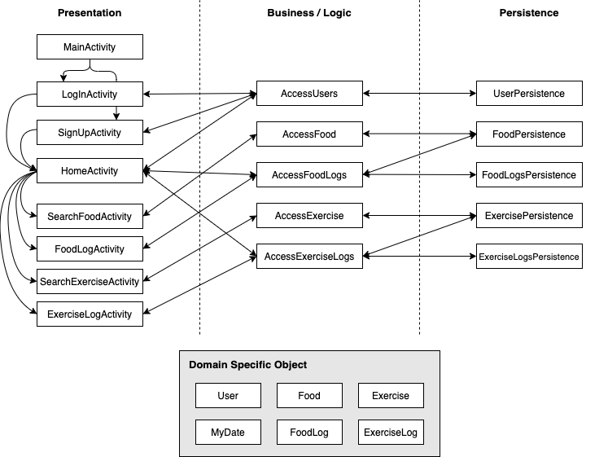

Architecture
============

Iteration 1 Diagram
-------------------

Presentation Layer
------------------
[MainActivity](https://code.cs.umanitoba.ca/3350-winter-2021-a01/fitnics-group-12/-/blob/master/app/src/main/java/com/group12/fitnics/presentation/MainActivity.java)
 - An entrance page that allows users to sign up or log in to go to the home screen

[LogInActivity](https://code.cs.umanitoba.ca/3350-winter-2021-a01/fitnics-group-12/-/blob/master/app/src/main/java/com/group12/fitnics/presentation/LogInActivity.java)
 - A screen that allows you to log in by entering a user name

[SignUpActivity](https://code.cs.umanitoba.ca/3350-winter-2021-a01/fitnics-group-12/-/blob/master/app/src/main/java/com/group12/fitnics/presentation/SignUpActivity.java)
 - A screen that asks for necessary information to register a user

[HomeActivity](https://code.cs.umanitoba.ca/3350-winter-2021-a01/fitnics-group-12/-/blob/master/app/src/main/java/com/group12/fitnics/presentation/HomeActivity.java)
 - A home screen where user can check calorie intake and calorie consumption during the day

[SearchFoodActivity](https://code.cs.umanitoba.ca/3350-winter-2021-a01/fitnics-group-12/-/blob/master/app/src/main/java/com/group12/fitnics/presentation/SearchFoodActivity.java)
 - A screen where to search for food to get information

[FoodLogActivity](https://code.cs.umanitoba.ca/3350-winter-2021-a01/fitnics-group-12/-/blob/master/app/src/main/java/com/group12/fitnics/presentation/FoodLogActivity.java)
 - A place where the types and amounts of foods eaten during the day are listed

[SearchExerciseActivity](https://code.cs.umanitoba.ca/3350-winter-2021-a01/fitnics-group-12/-/blob/master/app/src/main/java/com/group12/fitnics/presentation/SearchExerciseActivity.java)
 -  A screen where to search for exercise to get information

[ExerciseLogActivity](https://code.cs.umanitoba.ca/3350-winter-2021-a01/fitnics-group-12/-/blob/master/app/src/main/java/com/group12/fitnics/presentation/ExerciseLogActivity.java)
 - A place where the types and amounts of exercises done during the day are listed

Application Layer
-----------------
[Main](https://code.cs.umanitoba.ca/3350-winter-2021-a01/fitnics-group-12/-/blob/master/app/src/main/java/com/group12/fitnics/application/Main.java)
 - The class that sets up database

[Services](https://code.cs.umanitoba.ca/3350-winter-2021-a01/fitnics-group-12/-/blob/master/app/src/main/java/com/group12/fitnics/application/Services.java)
 - The class that provides persistence objects

Business Layer
--------------
[AccessUsers](https://code.cs.umanitoba.ca/3350-winter-2021-a01/fitnics-group-12/-/blob/master/app/src/main/java/com/group12/fitnics/business/AccessUsers.java)
 - The class the representation layer calls to do users-related things

[AccessFood](https://code.cs.umanitoba.ca/3350-winter-2021-a01/fitnics-group-12/-/blob/master/app/src/main/java/com/group12/fitnics/business/AccessFood.java)
 - The class the representation layer calls to do foods-related things

[AccessExercises](https://code.cs.umanitoba.ca/3350-winter-2021-a01/fitnics-group-12/-/blob/master/app/src/main/java/com/group12/fitnics/business/AccessExercises.java)
 - The class the representation layer calls to do exercises-related things

[AccessFoodLogs](https://code.cs.umanitoba.ca/3350-winter-2021-a01/fitnics-group-12/-/blob/master/app/src/main/java/com/group12/fitnics/business/AccessFoodLogs.java)
 - The class the representation layer calls to do food logs-related things

[AccessExerciseLogs](https://code.cs.umanitoba.ca/3350-winter-2021-a01/fitnics-group-12/-/blob/master/app/src/main/java/com/group12/fitnics/business/AccessExerciseLogs.java)
 - The class the representation layer calls to do exercise logs-related things

Persistence Layer
-----------------
[IUserPersistence](https://code.cs.umanitoba.ca/3350-winter-2021-a01/fitnics-group-12/-/blob/master/app/src/main/java/com/group12/fitnics/persistence/IUserPersistence.java)
 - The interface for handling the user in the database

[IFoodPersistence](https://code.cs.umanitoba.ca/3350-winter-2021-a01/fitnics-group-12/-/blob/master/app/src/main/java/com/group12/fitnics/persistence/IFoodPersistence.java)
 - The interface for handling the set of foods in the database

[IExercisePersistence](https://code.cs.umanitoba.ca/3350-winter-2021-a01/fitnics-group-12/-/blob/master/app/src/main/java/com/group12/fitnics/persistence/IExercisePersistence.java)
 - The interface for handling the set of exercises in the database

[IFoodLogPersistence](https://code.cs.umanitoba.ca/3350-winter-2021-a01/fitnics-group-12/-/blob/master/app/src/main/java/com/group12/fitnics/persistence/IFoodLogPersistence.java)
 - The interface for handling the food logs in the database

[IExerciseLogPersistence](https://code.cs.umanitoba.ca/3350-winter-2021-a01/fitnics-group-12/-/blob/master/app/src/main/java/com/group12/fitnics/persistence/IExerciseLogPersistence.java)
 - The interface for the exercise logs in the database

### Stubs
[UserPersistenceStub](https://code.cs.umanitoba.ca/3350-winter-2021-a01/fitnics-group-12/-/blob/master/app/src/main/java/com/group12/fitnics/persistence/UserPersistenceStub.java)
 - Current User implementation for the "database" for the app

[FoodPersistenceStub](https://code.cs.umanitoba.ca/3350-winter-2021-a01/fitnics-group-12/-/blob/master/app/src/main/java/com/group12/fitnics/persistence/FoodPersistenceStub.java)
 - Current Food implementation for the "database" for the app

[ExercisePersistenceStub](https://code.cs.umanitoba.ca/3350-winter-2021-a01/fitnics-group-12/-/blob/master/app/src/main/java/com/group12/fitnics/persistence/ExercisePersistenceStub.java)
 - Current Exercise implementation for the "database" for the app

[FoodLogPersistenceStub](https://code.cs.umanitoba.ca/3350-winter-2021-a01/fitnics-group-12/-/blob/master/app/src/main/java/com/group12/fitnics/persistence/FoodLogPersistenceStub.java)
 - Current FoodLog implementation for the "database" for the app

[ExerciseLogPersistenceStub](https://code.cs.umanitoba.ca/3350-winter-2021-a01/fitnics-group-12/-/blob/master/app/src/main/java/com/group12/fitnics/persistence/ExerciseLogPersistenceStub.java)
 - Current ExerciseLog implementation for the "database" for the app

Domain Specific Objects
-----------------------
[User](https://code.cs.umanitoba.ca/3350-winter-2021-a01/fitnics-group-12/-/blob/master/app/src/main/java/com/group12/fitnics/objects/User.java)
 - The user object

[Food](https://code.cs.umanitoba.ca/3350-winter-2021-a01/fitnics-group-12/-/blob/master/app/src/main/java/com/group12/fitnics/objects/Food.java)
 - The object representing one kind of food

[Exercise](https://code.cs.umanitoba.ca/3350-winter-2021-a01/fitnics-group-12/-/blob/master/app/src/main/java/com/group12/fitnics/objects/Exercise.java)
 - The object representing one kind of exercise

[FoodLog](https://code.cs.umanitoba.ca/3350-winter-2021-a01/fitnics-group-12/-/blob/master/app/src/main/java/com/group12/fitnics/objects/FoodLog.java)
 - The object indicating which user ate what food and how much on what date

[ExerciseLog](https://code.cs.umanitoba.ca/3350-winter-2021-a01/fitnics-group-12/-/blob/master/app/src/main/java/com/group12/fitnics/objects/ExerciseLog.java)
 - The object indicating which user did what exercise and how many minutes on what date

[MyDate](https://code.cs.umanitoba.ca/3350-winter-2021-a01/fitnics-group-12/-/blob/master/app/src/main/java/com/group12/fitnics/objects/MyDate.java)
 - The object for representing dates in FoodLog and ExerciseLog
