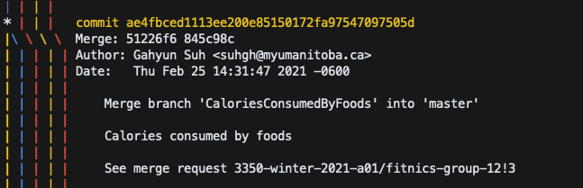

Iteration 1 Worksheet
=====================

Adding a feature
----------------
In this iteration, a feature called [Daily Progress](https://code.cs.umanitoba.ca/3350-winter-2021-a01/fitnics-group-12/-/issues/2) was added.
- This feature consists of two user stories. [Viewing progress](https://code.cs.umanitoba.ca/3350-winter-2021-a01/fitnics-group-12/-/issues/16) was implemented to show the list of foods the user ate and the list of exercises the user did today. In addition, the total caloric intake and total calories burned of the day can be calculated and displayed accordingly. ([Counting the calories consumed by food](https://code.cs.umanitoba.ca/3350-winter-2021-a01/fitnics-group-12/-/issues/19))
- Related tests (except for domain specific objects) are [AccessUsersTest](https://code.cs.umanitoba.ca/3350-winter-2021-a01/fitnics-group-12/-/blob/master/app/src/test/java/com/group12/fitnics/tests/business/AccessUsersTest.java), [AccessFoodLogsTest](https://code.cs.umanitoba.ca/3350-winter-2021-a01/fitnics-group-12/-/blob/master/app/src/test/java/com/group12/fitnics/tests/business/AccessFoodLogsTest.java), and [AccessExerciseLogsTest](https://code.cs.umanitoba.ca/3350-winter-2021-a01/fitnics-group-12/-/blob/master/app/src/test/java/com/group12/fitnics/tests/business/AccessExerciseLogsTest.java).
- [Merge request](https://code.cs.umanitoba.ca/3350-winter-2021-a01/fitnics-group-12/-/merge_requests/3)
- [Merge commit that was used complete the feature](https://code.cs.umanitoba.ca/3350-winter-2021-a01/fitnics-group-12/-/commit/ae4fbced1113ee200e85150172fa97547097505d)

Exceptional code
----------------

Branching
---------
- [Branching strategy](Branching Strategy.md)

- screen shot of a feature being added

SOLID
-----
SOLID violation in the project of group 1: [Link](https://code.cs.umanitoba.ca/3350-winter-2021-a01/group-1/-/issues/43)

Agile Planning
--------------
- We found that [updating user information](https://code.cs.umanitoba.ca/3350-winter-2021-a01/fitnics-group-12/-/issues/14) actually had a relatively low priority compared to other user stories for Iteration 1, so it was pushed to the next iteration.
- The [Food Logger](https://code.cs.umanitoba.ca/3350-winter-2021-a01/fitnics-group-12/-/issues/18) and [Exercise Logger](https://code.cs.umanitoba.ca/3350-winter-2021-a01/fitnics-group-12/-/issues/22) that we currently have can show the user a list of food or exercise for the day, but have not implemented a function that allows new items to be added to the lists. Therefore, they are expected to be completed in the next iteration.
