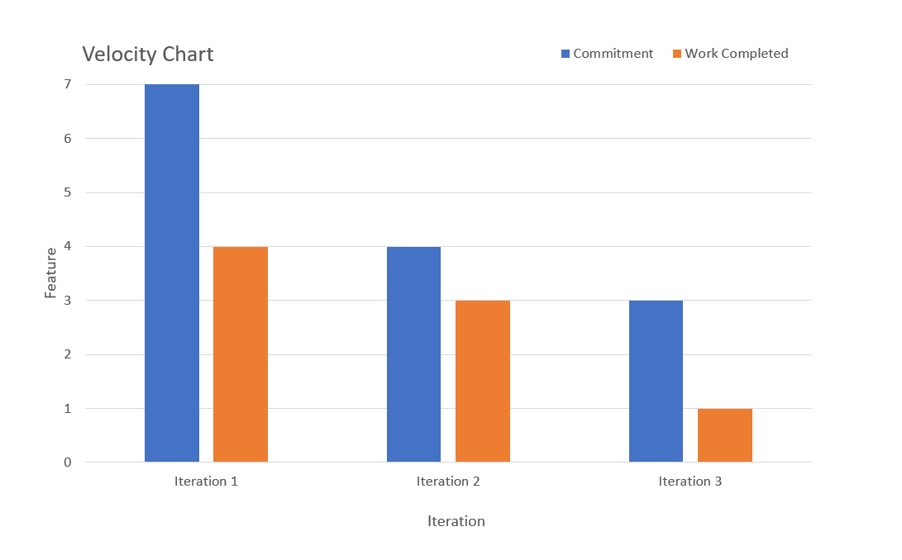

Iteration 3 Worksheet
======================

What technical debt has been cleaned up
---------------------------------------
- Following OCP in User class
  - The gender, activity level, and goal variables of the User class were represented as some constant values of integer or character type. This makes it difficult to extend or modify the code to meet additional or changing requirements that may arise in the future.
  - These variables were changed to be enum type, and the code was modified so that OCP violation does not occur when these values are used in the UI layer or the logic layer.
  - This dept can be classified into Prudent & Inadvertent type. Initially, we started developing without considering the possibility that new requirements might emerge, and it resulted in code that was difficult to maintain and change because it did not comply with design rules such as OCP. 
  - Almost every changes made in [this commit](https://code.cs.umanitoba.ca/3350-winter-2021-a01/fitnics-group-12/-/commit/0c8f37e32c269660ddc9fb5e0e57d58c4bbebe53) is paying technical debt.

What technical debt did you leave?
----------------------------------
- The coverage of the acceptance test is not very high. 
  - If it could simulate a little more user behaviors, the system would have been stable even if there were modifications to the code. However there was not enough time to increase the coverage.
  - This dept can be classified into Prudent & Inadvertent type. For most features, one feature is being tested in almost one method, which will certainly not be easy to test if any changes are made in the feature later.

Discuss a Feature or User Story that was cut/re-prioritized
-----------------------------------------------------------
- At the beginning of Iteration 3, we discussed dropping all features related to social services.
- One of them is a feature that allows users to search for other users. [Link](https://code.cs.umanitoba.ca/3350-winter-2021-a01/fitnics-group-12/-/issues/11)​
- We couldn't complete all of the planned features during the project because we didn't get as fast as we expected, so we dropped the lowest priority feature out of all the features.
- Because we had to practice while learning how to write clean code that follows various patterns and design principles, it seems that the speed was not as fast as originally planned. The problem of proficiency in Android app development or database integration also seems to be a reason which slowed down the speed.

Acceptance test/end-to-end
--------------------------
- A test for calculating intake calories from foods, burned calories from exercises, and remaining calories to reach a daily goal can result in the values that could vary depending on the date the test was actually run. In other words, the test might have an indeterministic aspect.
- As a solution, we make the test start with creating a new user just for testing purpose. It processes adding some food and exercise records, and it makes sure the calories calculations are correct. 
- Finally, by deleting the test user at the end of the test, the test can be completed on any date, deterministically. 

Acceptance test, untestable
---------------------------
- Push notification
  - We wanted to test if a user actually receive the push notification that he/she set. 
  - However, actually setting a specific time for the notification and making it wait until that time comes is not only complicated to write the test code, it will also make us spend too much time on testing.
  - It was considered almost untestable, due to the limited time given us and our immaturity in using espresso.

Velocity/teamwork
-----------------

Compared to the beginning, we can say that our estimate get better. 
This is because at the beginning we don't have experience about how much time to complete each feature. 
With the end of the first iteration, we found that we should remove some features and increase the estimated time for each feature. 
This helped us basically complete the feature we set in the iteration 2. 
In iteration 3, we did a lot of refactoring, but this conflicted with the new features we developed. 
As a result, some new features cannot be launched on time. 
So in terms of estimates, we did better than before.
Relevant evidence [Iteration 1 · Milestones ](https://code.cs.umanitoba.ca/3350-winter-2021-a01/fitnics-group-12/-/milestones/1) [Iteration 2 · Milestones](https://code.cs.umanitoba.ca/3350-winter-2021-a01/fitnics-group-12/-/milestones/2) [Iteration 3 · Milestones](https://code.cs.umanitoba.ca/3350-winter-2021-a01/fitnics-group-12/-/milestones/3).

